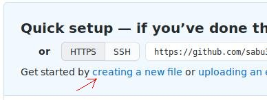
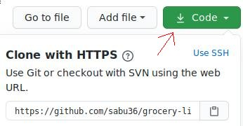

0\. Sign up on github; Install `git`

### 1. Setting up a repository

(When you work on someone else's existing repository, you would click *Fork* button here instead.)

 -> name it `grocery-list`

 -> `README.md` with text `apple`

### 2. Copying over the repository to your computer



(Open terminal `$`. After entering a command, you're expected to read the output to follow this tutorial.)

`$ git clone [copied-url]` &emsp; creates a directory `grocery-list`

`$ cd grocery-list` &emsp; `cd` stands for change directory

## A. Working with a single branch

### A1. Making and saving a change in your computer

Open `README.md` in a text editor; add `orange`.

`$ git status`\
`$ git commit -m "Add orange"` &emsp; `-m` stands for message\
The last line did nothing. An additional step is required.

`$ git add README.md`\
`$ git status`\
`$ git commit -m "Add orange"`

### A2. Uploading the change to github

`$ git push`

## B. Working with 2 branches

This is for when working with other people.

### B1. Creating new branches

`$ git status`\
`$ git branch`

`$ git branch add-pear` &emsp; creates a branch\
`$ git branch add-watermelon`

### B2. Working on one of the branches

This simulates another person modifying the file before you upload your change (in step B3).

`$ git checkout add-pear` &emsp; switch to a branch

In `README.md`, add `pear` and commit it.\
`$ git push origin add-pear`

(Back to github.)

*Compare & pull request*\
*Merge pull request*\
*Delete branch*

### B3. Working on the other branch

(Back to terminal.)

Switch to the other branch.

In `README.md`, add `watermelon` and commit it. 

`$ git pull --rebase origin main` &emsp; see the first 3 diagrams of this [explanation](https://git-scm.com/book/en/v2/Git-Branching-Rebasing) of `rebase`

`$ git status`\
Edit `README.md` so that we have:
```
apple
orange
pear
watermelon
```
`$ git rebase --continue`

`$ git push origin add-watermelon`

(Back to github.)

Pull request, merge, and delete branch.

### B4. Updating the repository in your computer with github's

(Alternatively, delete the directory and then `clone` as in [section 2](#2-copying-over-the-repository-to-your-computer).)

`$ git checkout main`\
`$ git pull`\
`$ git branch -d add-pear add-watermelon` &emsp; `-d` stands for delete

## Closing note

That's it!

If you found something unclear or erroneous, please make an *issue*.
