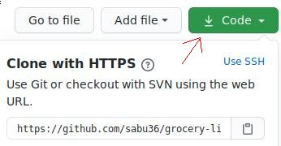

<n/>0. Sign up github; and install `git`

### 1. Setting up a repository

 -> name it `grocery-list`

 -> `fruits.txt` with text `apple`

(If you are working on someone else's repository, you need to *Fork* it here.)

### 2. Copying over the repository to your computer

(Open terminal `$`.)

`$ git clone [copied-url]` &emsp; creates a directory `grocery-list`

`$ cd grocery-list` &emsp; cd stands for change directory

### 3. Creating a new branch and switching to it

`$ git status`\
`$ git branch`\
`$ git branch add-fruits`\
`$ git checkout add-fruits`

### 4. Adding a fruit

In `fruits.txt`, add `orange`.

`$ git status`\
`$ git commit -m "Add orange"` &emsp; `-m` stands for message\
The last line did nothing. An additional step is required.

`$ git add fruits.txt`\
`$ git status`\
`$ git commit -m "Add orange"`

### 5. Adding another fruit

In `fruits.txt`, insert `lemon` between `apple` and `orange`.\
Commit with message "Insert lemon".

### 6. Uploading the changes to github; and merging it to master branch

`$ git push origin add-fruits`

(Back to github.)

*Compare & pull request*, `Add 2 fruits: lemon, orange`\
*Merge pull request*\
*Delete branch*

### 7. Updating the repository in your computer with github's

`$ git checkout master`\
`$ git pull origin master`\
`$ git branch -d add-fruits`

### Exercise

Make a branch `add-vegetables`.\
Add file `vegetables.txt` with some veggies.\
Pull and merge it.
